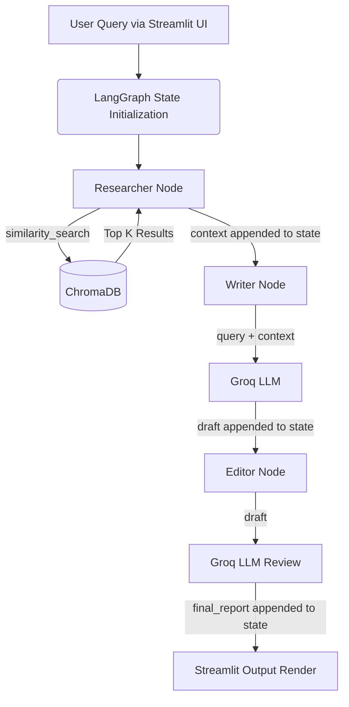

# Real Estate Data Intelligence: Multi-Agent Architecture

## Overview
The real estate sector thrives on data synthesis—combining property listings, market trends, and localized insights. This project implements a **Multi-Agent Research Pipeline** using LangGraph, the Groq API (running Meta's Llama 3 models), and ChromaDB. It automates the generation of high-quality, structured property and market analysis reports. 

The system transitions raw, unstructured real estate context from a vector database into a polished, professional report seamlessly mimicking workflows such as investment analysis and property due diligence.

## Agents
The pipeline orchestrates three distinct intelligent agents:

1. **Researcher Agent**
   - **Role:** Data aggregation and context retrieval.
   - **Responsibility:** Accepts the raw query, queries the local ChromaDB vector store for semantic matches (e.g., comps, market data), and retrieves the most relevant context.
2. **Writer Agent**
   - **Role:** Content structuring and drafting.
   - **Responsibility:** Receives the original query and the structured context from the Researcher. Synthesizes the information into a logical draft, emphasizing ROI, property stats, and market trends.
3. **Editor Agent**
   - **Role:** Quality assurance and formatting.
   - **Responsibility:** Refines the Writer's draft. Ensures the tone is professional, analytical, and tailored to high-net-worth investors or commercial brokers. Outputs strict Markdown format.

## Architecture
- **Orchestration Layer:** LangGraph allows stateful agent routing and sequential invocation without complex custom loops.
- **Reasoning Layer:** Groq ecosystem running `llama3-70b-8192` ensures lightning-fast reasoning and text generation.
- **Knowledge Retrieval:** ChromaDB provides ephemeral (or persistent) vector storage for RAG (Retrieval-Augmented Generation), leveraging `all-MiniLM-L6-v2` embeddings for semantic similarity.
- **Frontend Layer:** Built using Streamlit, featuring real-time graph event streaming and a custom CSS styled "reactive" interface capable of tracking agent progress dynamically.

## Data Flow


## Code Example
_Demonstrating the LangGraph construction and node design._

```python
from langgraph.graph import StateGraph, START, END

class RealEstateGraphState(TypedDict):
    query: str
    context: str
    draft: str
    final_report: str
    current_step: str

# Example Agent Node
def writer_agent(state: RealEstateGraphState):
    llm = get_llm()
    prompt = f"..." # Prompts query and context
    res = llm.invoke(prompt)
    return {"draft": res.content, "current_step": "writer"}

def build_graph():
    builder = StateGraph(RealEstateGraphState)
    builder.add_node("researcher", researcher_agent)
    builder.add_node("writer", writer_agent)
    builder.add_node("editor", editor_agent)
    
    # State transition logic
    builder.add_edge(START, "researcher")
    builder.add_edge("researcher", "writer")
    builder.add_edge("writer", "editor")
    builder.add_edge("editor", END)
    
    return builder.compile()
```

## Sample Output
If the user inputs: **"Analyze the ROI potential for commercial properties in Austin"**

> **Executive Summary**
> The Austin commercial real estate market presents a promising landscape for investment, driven by a robust tech sector and a stabilizing economic climate. With interest rates hovering around 6%, the market is witnessing growing demand, particularly in downtown areas. 
> 
> **Market Insights / Comps**
> - **Downtown Austin Commercial Property XYZ:** Asking price $5.2M. Cap rate 6.5%. Leased to tech startup till 2030. High ROI potential due to tech boom.
> - **Austin Market Trend Q3:** Commercial office space availability is tight, at 5% vacancy.
> 
> **ROI Potential & Risks**
> Properties like Property XYZ offer attractive cap rates (6.5%) and long-term lease stability, minimizing risk and maximizing ROI. The overall market tightness further indicates property appreciation.
